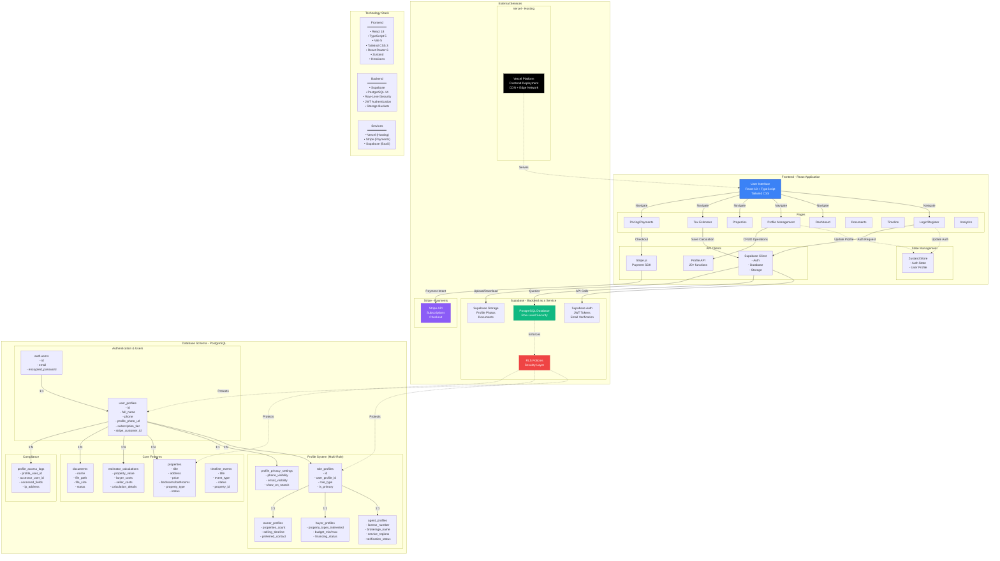
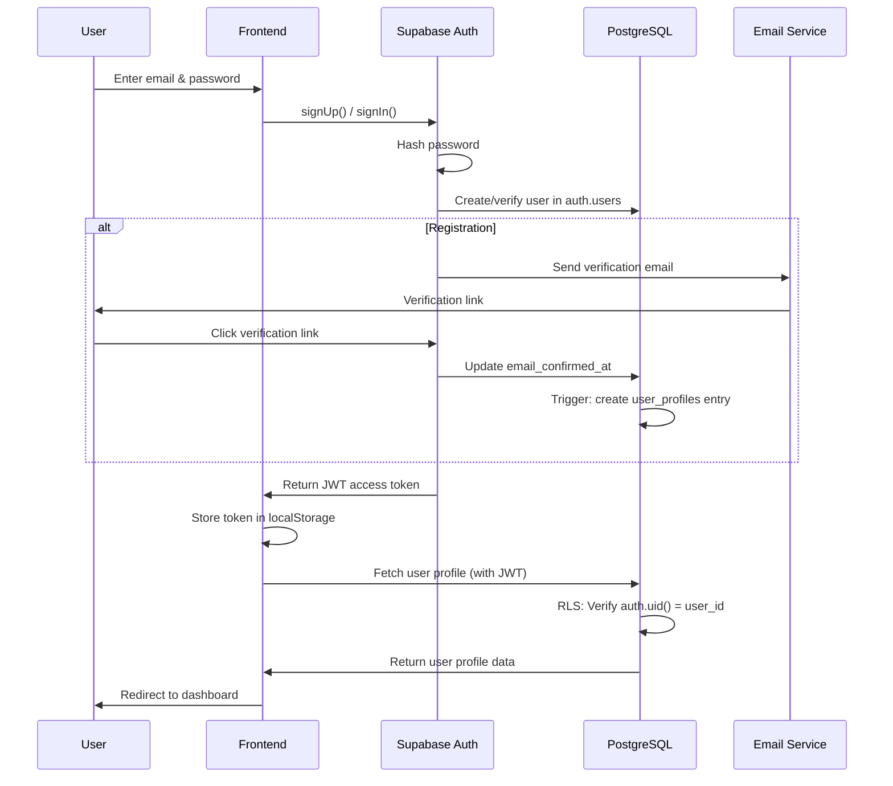
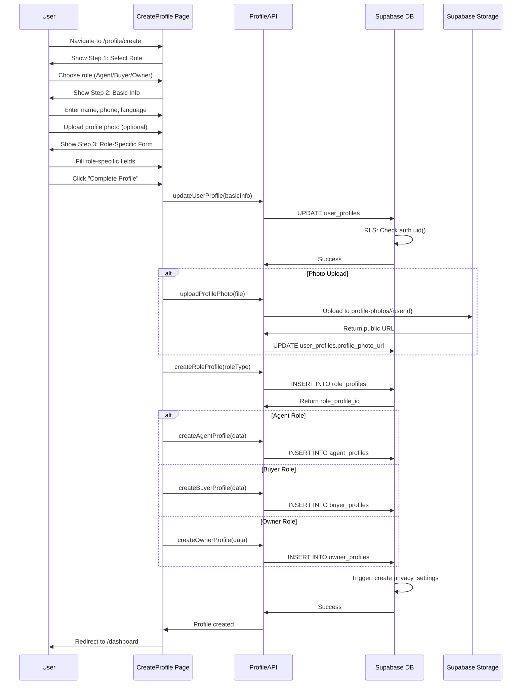
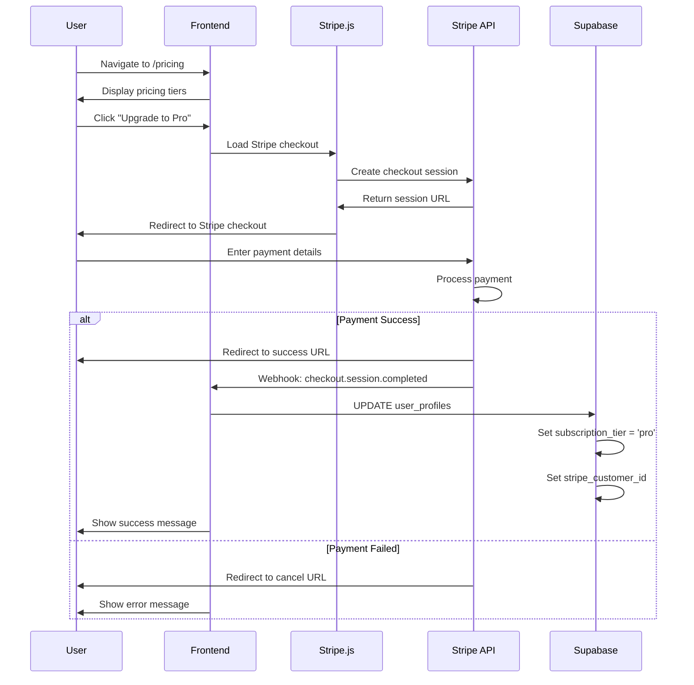
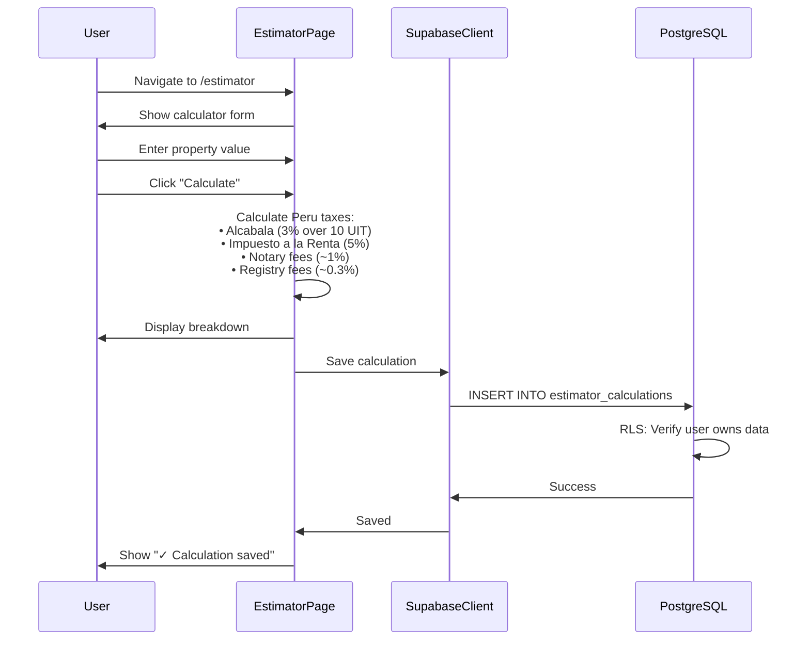

# RealSync - Application Architecture Diagram

## Complete Architecture Diagram (Mermaid)



## Authentication Flow



## Profile Creation Flow (Sprint 4)



## Payment Flow (Stripe Integration)



## Tax Estimator Data Flow



## Security Architecture (Row-Level Security)

```mermaid
---

## Key Statistics

### Database
- **Tables**: 11 tables
  - Authentication: 2 (auth.users, user_profiles)
  - Profiles: 5 (role_profiles, agent_profiles, buyer_profiles, owner_profiles, privacy_settings)
  - Features: 3 (properties, estimator_calculations, documents, timeline_events)
  - Audit: 1 (profile_access_logs)

### Frontend
- **Pages**: 9 pages
- **Components**: 20+ components
- **Lines of Code**: ~3,600 lines (TypeScript + React)

### Features Implemented
- ✅ Authentication (Supabase Auth)
- ✅ User Profiles (Multi-role: Agent/Buyer/Owner)
- ✅ Tax Estimator (Peru-specific calculations)
- ✅ Properties Management
- ✅ Documents (metadata only)
- ✅ Timeline Events
- ✅ Stripe Payments Integration
- ✅ Privacy Controls
- ✅ Profile Photo Upload

### Security
- ✅ Row-Level Security on all tables
- ✅ JWT authentication
- ✅ Email verification
- ✅ Encrypted passwords
- ✅ HTTPS (Vercel)
- ✅ Audit logging

### Tech Stack
- **Frontend**: React 18, TypeScript, Vite, Tailwind CSS
- **Backend**: Supabase (PostgreSQL, Auth, Storage)
- **Hosting**: Vercel
- **Payments**: Stripe
- **Database**: PostgreSQL 14 with RLS
