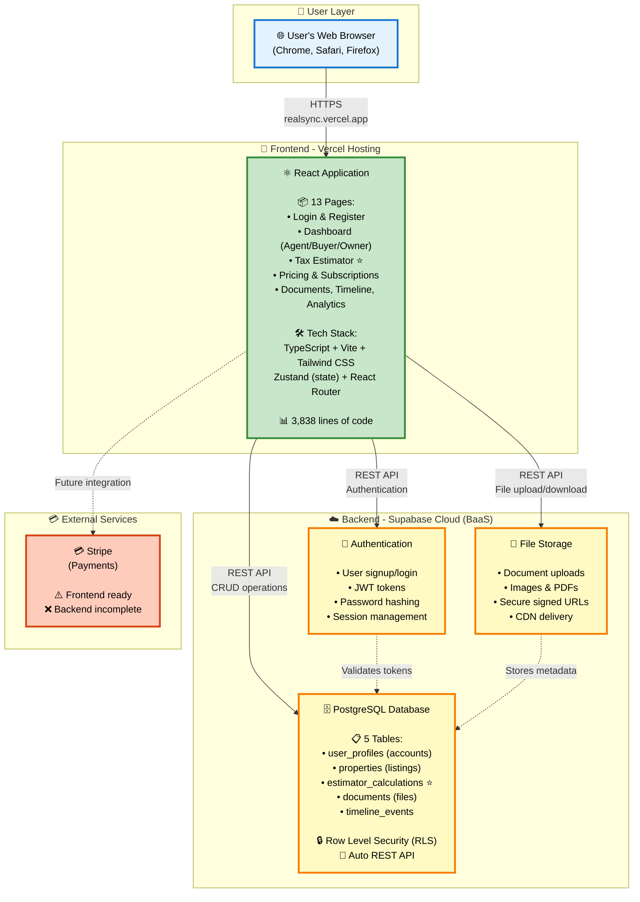
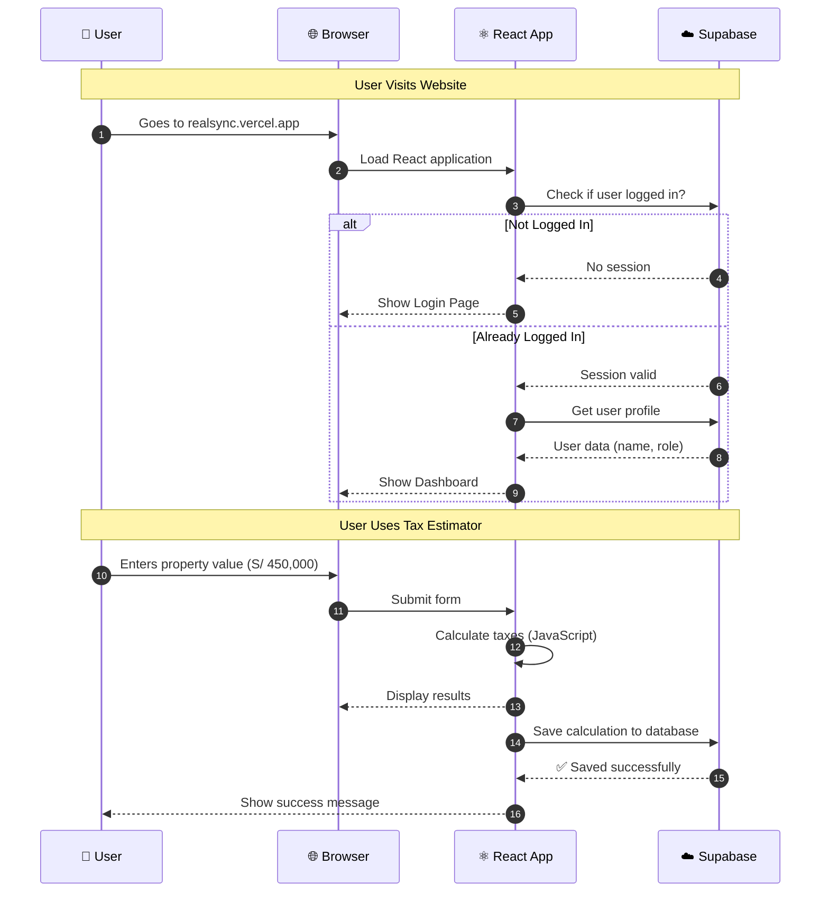
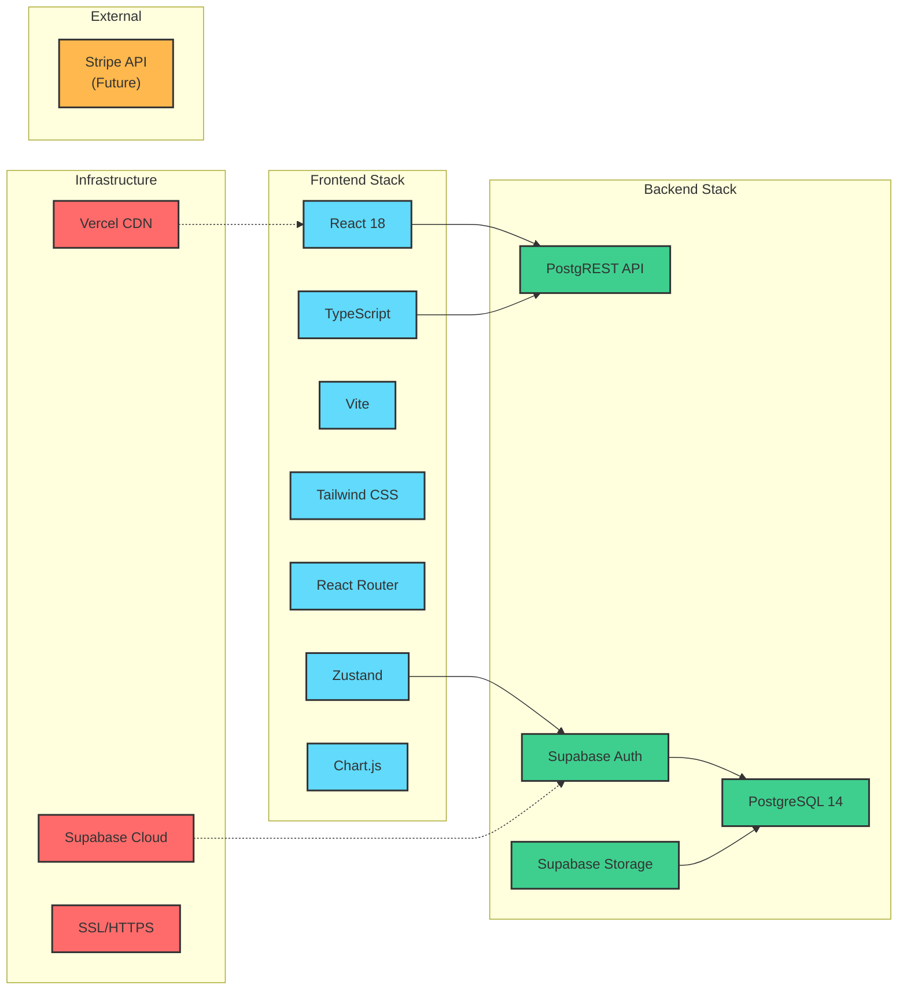
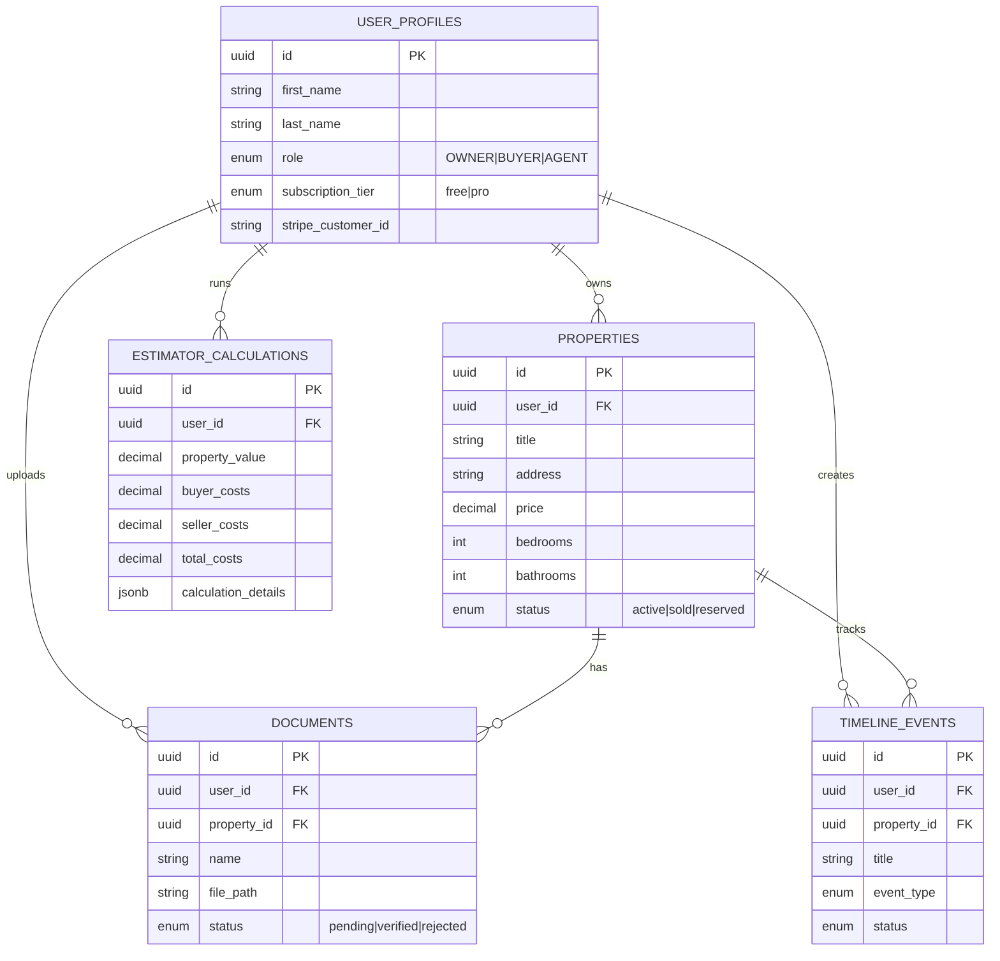
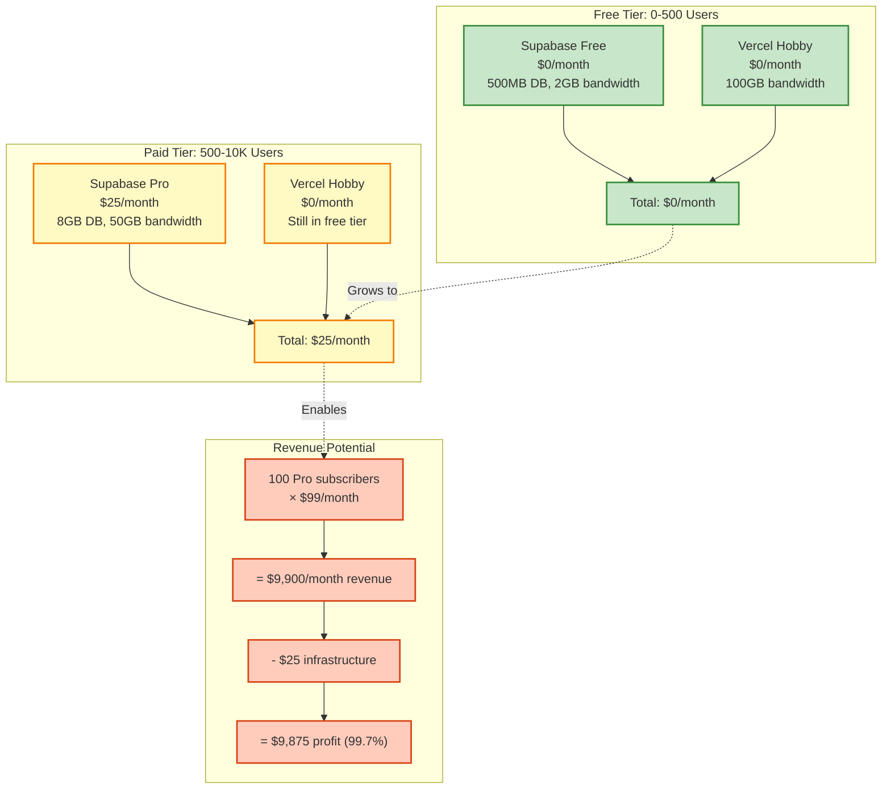

# RealSync Architecture Diagram (Simple - 1 Page)

**Purpose:** Visual representation of actual running architecture
**Export Instructions:** Copy Mermaid code to https://mermaid.live and download as PNG/PDF

---

## Main Architecture Diagram

Copy this code to mermaid.live:

---

## Simplified Flow Diagram (User Journey)

Copy this code to mermaid.live:

---

## Technology Stack Diagram

Copy this code to mermaid.live:

---

## Database Schema (Entity Relationship)

Copy this code to mermaid.live:

---

## Cost Structure Diagram

Copy this code to mermaid.live:

---

## Export Instructions

### Method 1: Mermaid Live (Recommended)

1. Go to **https://mermaid.live**
2. Copy any diagram code from above
3. Paste into the editor (left side)
4. Diagram renders automatically (right side)
5. Click **"Download PNG"** or **"Download SVG"**
6. Use in your presentation!

### Method 2: VS Code

1. Install extension: **"Markdown Preview Mermaid Support"**
2. Open this file in VS Code
3. Click preview button
4. Take screenshot or print to PDF

### Method 3: GitHub

1. Push this file to GitHub
2. Diagrams render automatically
3. Right-click diagram → Save image

---

## Diagram Usage Tips

### For Sprint 4 Video:

**Opening (0-30 sec):**
- Show **Main Architecture Diagram**
- "This is RealSync - React frontend, Supabase backend, hosted on Vercel"

**Middle (30-90 sec):**
- Show **Simplified Flow Diagram**
- Walk through user journey: "User visits site, logs in, uses tax estimator, data saved to database"

**Closing (90-120 sec):**
- Show **Cost Structure Diagram**
- "Built for $0/month, scales to $25/month, 99.7% profit margin"

### For Presentations:

- **Executive audience:** Main Architecture + Cost Structure
- **Technical audience:** Main Architecture + Database Schema
- **Investor pitch:** Cost Structure + User Journey

---

## Key Messages (Use These)

### Architecture
✅ "Modern BaaS architecture using Supabase"
✅ "3,838 lines of production code"
✅ "Can handle 10,000 concurrent users"
❌ "Complex microservices with 11 services" (not true)

### Technology
✅ "React + TypeScript + Tailwind CSS"
✅ "PostgreSQL with Row Level Security"
✅ "Serverless hosting on Vercel"
❌ "Custom Node.js backend" (not true)

### Business
✅ "Built on free tier, scales to $25/month"
✅ "99.7% profit margin on subscriptions"
✅ "Fast MVP development (3 weeks)"
❌ "Enterprise-scale infrastructure" (not yet)

---

## What Makes This Architecture Good

### For MVP Stage:
1. **Fast Development** - No backend code needed
2. **Low Cost** - $0-25/month
3. **Automatic Scaling** - Supabase handles it
4. **Built-in Security** - RLS, JWT, encryption
5. **Type Safety** - TypeScript catches bugs early

### For Learning:
1. **Understand Trade-offs** - Speed vs control
2. **Right-sizing Decisions** - Don't over-engineer
3. **Cost Awareness** - BaaS vs custom backend
4. **Modern Patterns** - Industry-standard stack
5. **Clear Migration Path** - Can scale when needed

---

## Common Questions & Answers

**Q: Why not build custom backend?**
A: BaaS is 10x faster for MVP. Build custom backend when Supabase limits are hit (10K+ users).

**Q: Is this production-ready?**
A: Yes! Architecture can handle real users today. Supabase has 99.9% uptime SLA.

**Q: When to switch to microservices?**
A: When revenue justifies infrastructure costs ($10K+ MRR) or need custom features Supabase can't provide.

**Q: What about the docker-compose.yml file?**
A: That's the future architecture plan, not current implementation. Documenting vision is good, but should be labeled clearly.

**Q: How secure is this?**
A: Very secure. Row Level Security enforces data access at database level. JWT tokens expire after 1 hour. Passwords hashed with bcrypt.

---

## Summary

**Current Architecture:**
- Frontend: React on Vercel
- Backend: Supabase BaaS
- Database: PostgreSQL (5 tables)
- Cost: $0-25/month
- Capacity: 1K-10K users

**This is a strategic choice**, not a limitation. It enables fast iteration while maintaining a clear path to scale.

The diagrams above show **what actually exists and runs in production** - not future plans or aspirations.

---

**For Video:** Use Main Architecture + User Journey diagrams (2 minutes)
**For Presentation:** Use all 5 diagrams (10 slides)
**For Documentation:** This file + ARCHITECTURE_REALITY.md
