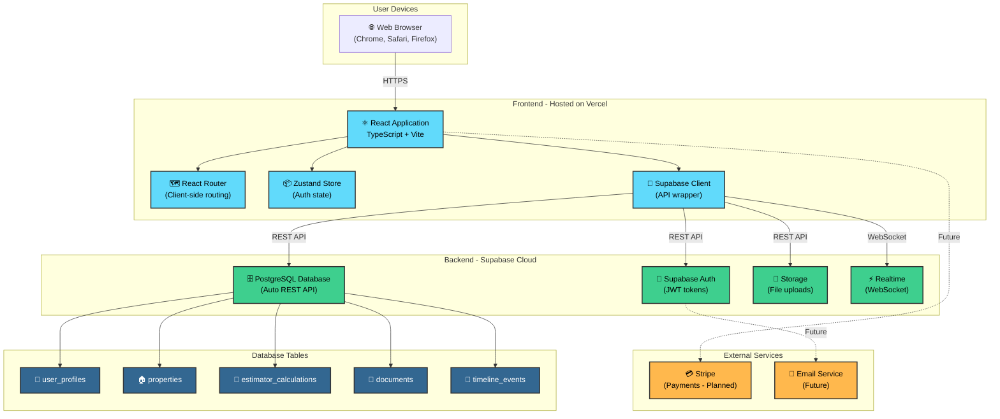
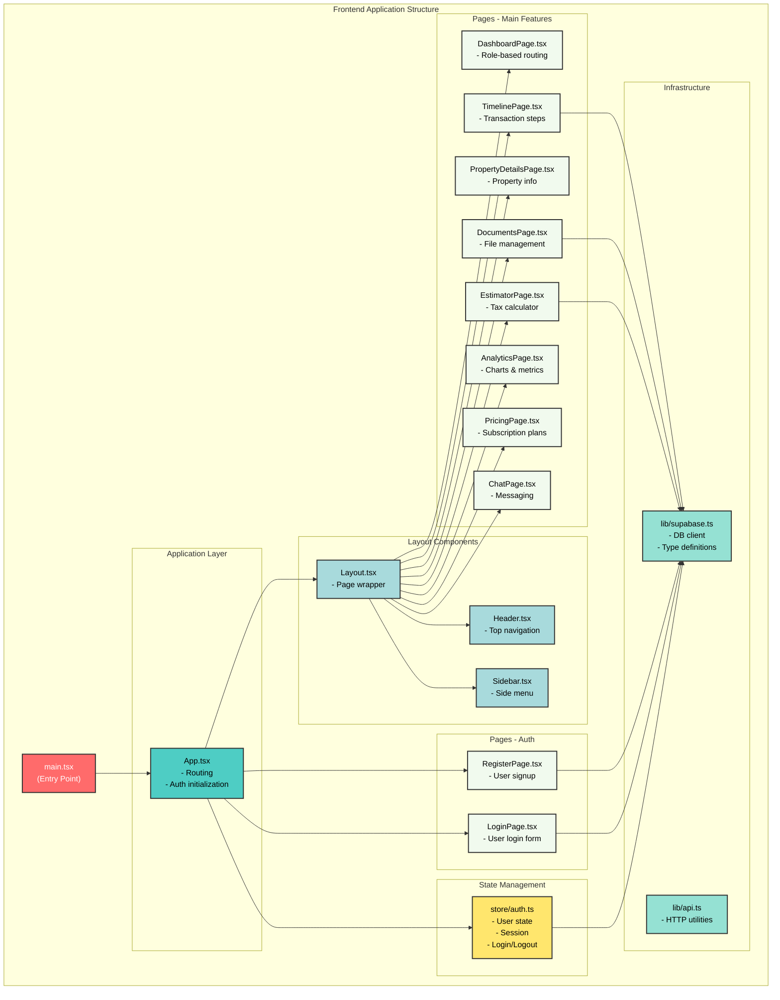
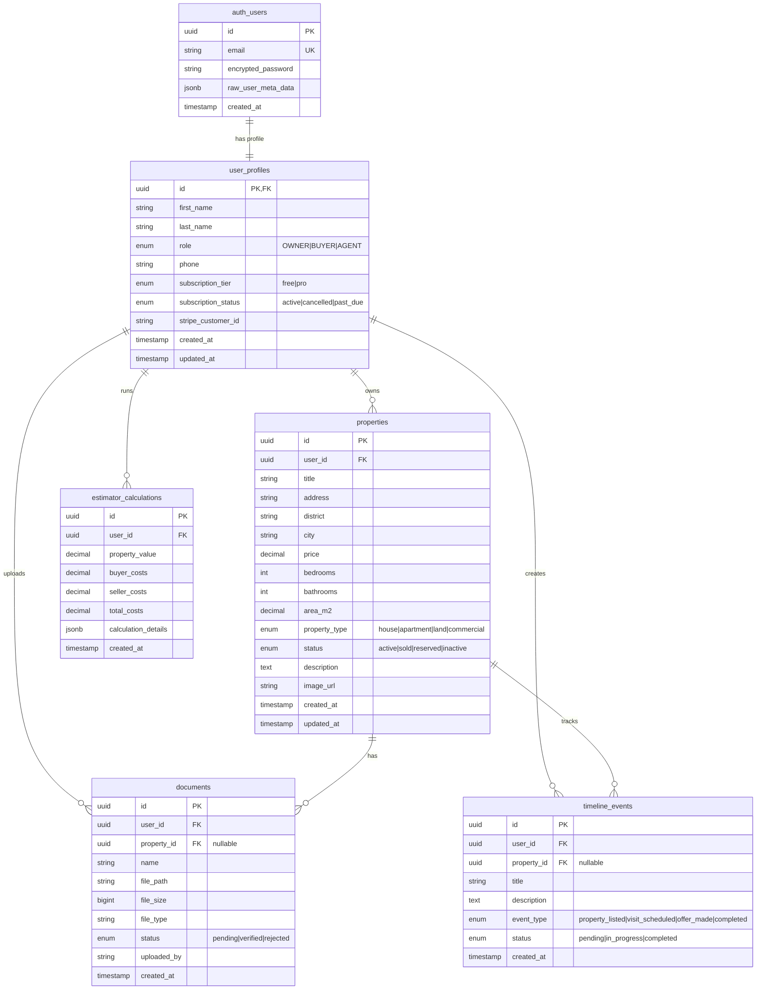
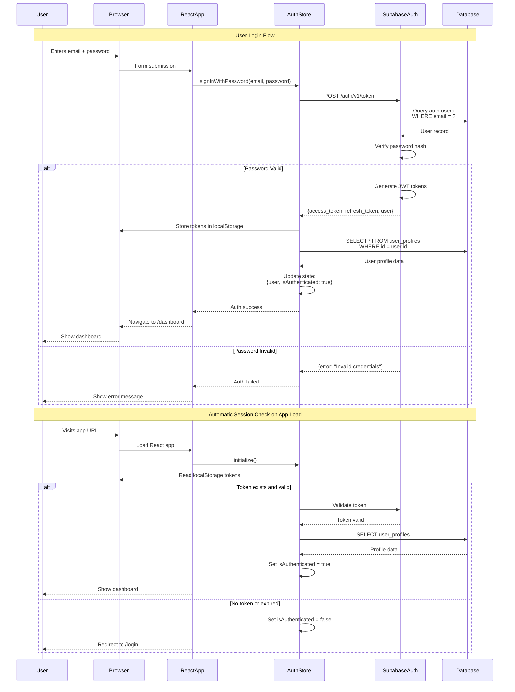
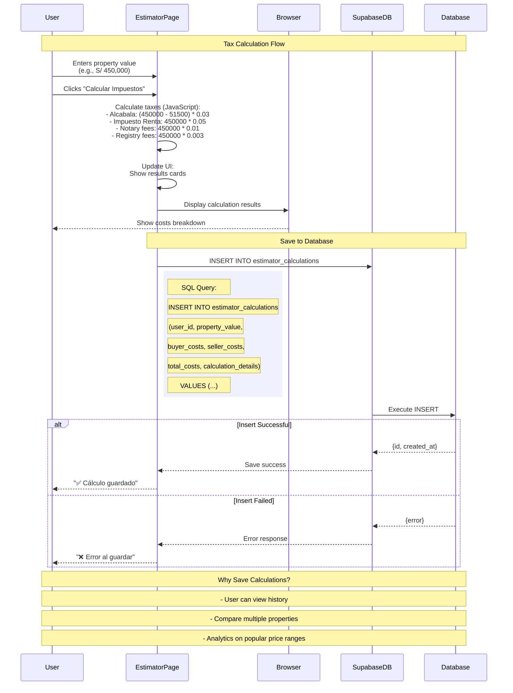
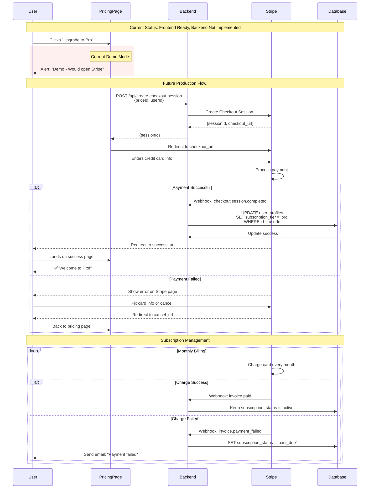
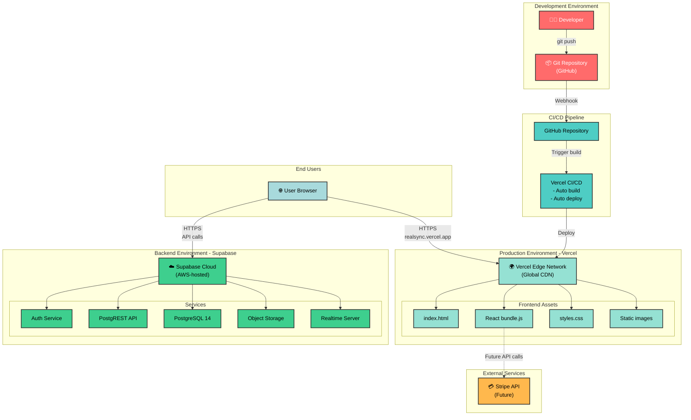
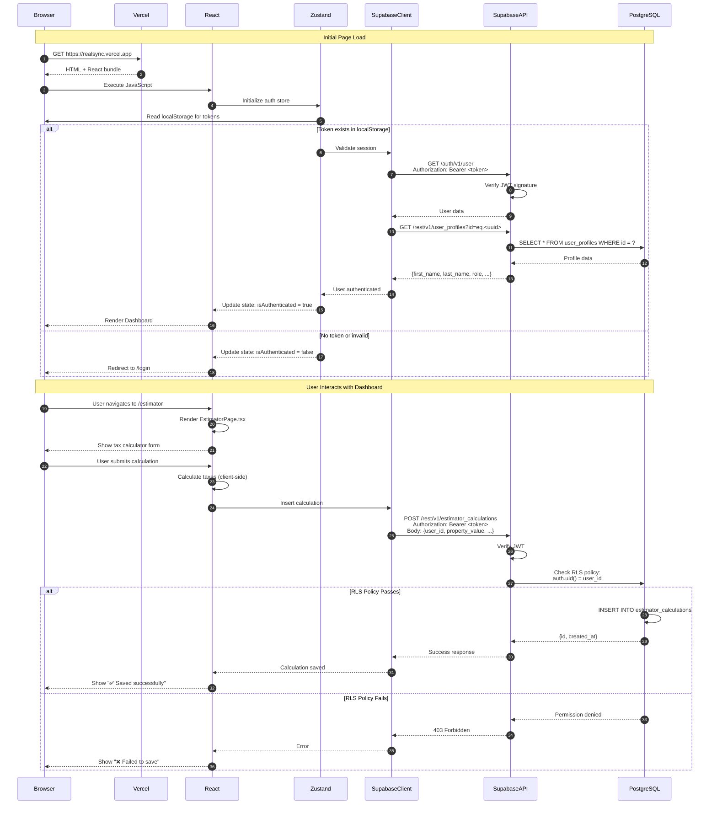
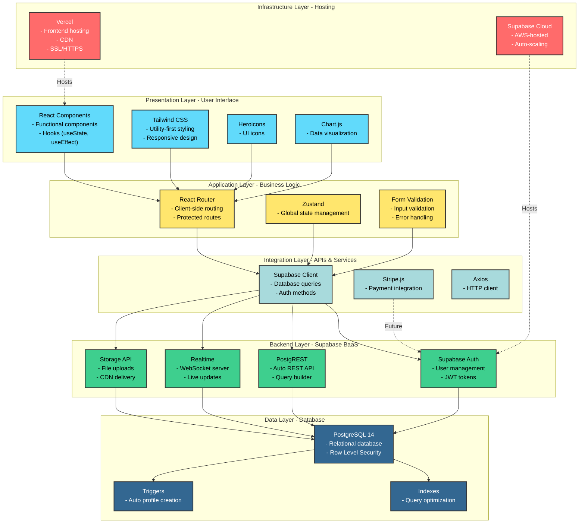

# RealSync Architecture Diagrams

## Introduction

This document contains visual architecture diagrams for your RealSync application using Mermaid syntax. These diagrams show how all components connect and interact.

**How to view these diagrams:**
1. **GitHub:** Automatically renders Mermaid diagrams
2. **VS Code:** Install "Markdown Preview Mermaid Support" extension
3. **Online:** Copy code to https://mermaid.live
4. **Export:** Use mermaid.live to export as PNG/SVG/PDF

---

## Diagram 1: High-Level System Architecture

This diagram shows the overall system architecture and how users interact with your application.

---

## Diagram 2: Frontend Application Structure

This diagram shows how the React frontend is organized and how components interact.

---

## Diagram 3: Database Schema & Relationships

This diagram shows all database tables and their relationships.

---

## Diagram 4: Authentication Flow

This diagram shows the complete user authentication process from login to accessing protected pages.

---

## Diagram 5: Tax Estimator Data Flow

This diagram shows what happens when a user calculates property taxes.

---

## Diagram 6: Payment Flow (Stripe - Future Implementation)

This diagram shows the planned payment flow for Pro plan upgrades.

---

## Diagram 7: Deployment & Infrastructure

This diagram shows how the application is deployed and hosted.

---

## Diagram 8: Request/Response Flow (Complete User Journey)

This comprehensive diagram shows a complete user journey from initial page load to data retrieval.

---

## Diagram 9: Technology Stack Layers

This diagram shows the complete technology stack organized by layers.

---

## How to Use These Diagrams

### Viewing Options:

1. **GitHub/GitLab**
   - Mermaid diagrams render automatically
   - Just push this file and view it

2. **VS Code**
   - Install: "Markdown Preview Mermaid Support" extension
   - Open this file and click preview button

3. **Mermaid Live Editor**
   - Go to https://mermaid.live
   - Copy any diagram code
   - Paste and it renders instantly
   - Export as PNG/SVG/PDF

4. **Documentation Sites**
   - Many doc platforms support Mermaid (GitBook, Docusaurus, MkDocs)

### For Your Sprint 4 Presentation:

1. **Export diagrams as images:**
   - Use mermaid.live to convert to PNG
   - Download and add to presentation slides

2. **Print this document:**
   - Open in browser (with Mermaid extension)
   - Print to PDF for physical reference

3. **Video explanation:**
   - Screen record while walking through each diagram
   - Explain each box and arrow
   - Use diagrams as visual aids

---

## Summary

You now have comprehensive visual documentation showing:

1. **High-level architecture** - Overall system design
2. **Frontend structure** - How React app is organized
3. **Database schema** - Tables and relationships
4. **Authentication flow** - Login process step-by-step
5. **Tax estimator flow** - Feature-specific data flow
6. **Payment flow** - Future Stripe integration
7. **Deployment** - How code becomes a live website
8. **Request/response** - Complete user journey
9. **Technology stack** - All layers of the system

These diagrams will help you:
- Explain your architecture to stakeholders
- Onboard new developers
- Plan new features
- Understand system dependencies
- Prepare for technical interviews

**As a product manager**, you can now confidently discuss technical architecture with engineers and make informed decisions about scalability, features, and technical debt!
